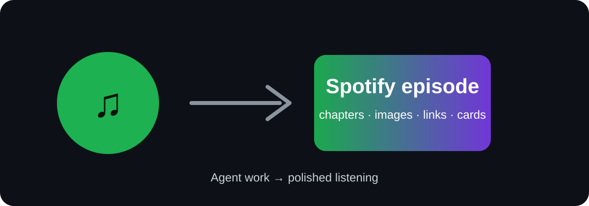
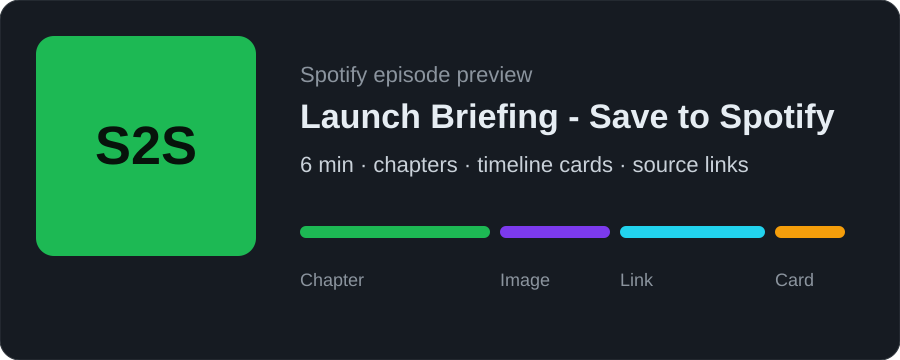

<p align="center">
  
</p>

<h1 align="center">Save to Spotify</h1>

<p align="center">
  <strong>The official Spotify skill for saving agent-made audio to Spotify.</strong>
</p>

<p align="center">
  Turn files, notes, links, transcripts, or generated audio into Spotify episodes with cover art, chapters, timeline images, links, and Spotify cards.
</p>

<p align="center">
  <a href="https://officialskills.sh/spotify/save-to-spotify"><strong>OfficialSkills</strong></a> ·
  <a href="https://clawhub.ai/spotify/save-to-spotify"><strong>ClawHub</strong></a> ·
  <a href="#install"><strong>Install</strong></a> ·
  <a href="#safety"><strong>Safety</strong></a>
</p>

<p align="center">
  
  
</p>

---

## What it does

Save to Spotify lets an agent create or upload audio and save it where you already listen.

Use it for placeholder workflows like:

- `[placeholder source]` → Spotify episode
- `[placeholder source material]` → polished audio output
- `[placeholder repeatable listening workflow]`
- `[placeholder internal notes / updates / docs]` → audio

<p align="center">
  
</p>

## Install

Prompt your agent to install:

```text
> Install Save to Spotify by running https://saveto.spotify.com/install.sh
```

Or run it yourself:

```bash
curl -fsSL https://saveto.spotify.com/install.sh | bash
```

Then authenticate once:

```bash
save-to-spotify auth login
save-to-spotify doctor
```

Other install paths:

```bash
openclaw skills install @spotify/save-to-spotify
npx skills add spotify/save-to-spotify
```

## Example prompt

```text
Turn [placeholder source] into a [placeholder duration] Spotify episode.
Use [placeholder style].
Save it to [placeholder show].
Preview before uploading.
```

## What it can produce

- audio upload: MP3, M4A, WAV, OGG
- show and episode metadata
- cover image
- chapters
- timeline images
- source links
- Spotify entity cards
- readiness checks

## Safety

The skill should preview and ask before it writes to Spotify.

It should clearly show:

- active Spotify account
- requested OAuth scopes
- read-only vs write actions
- what will be created or changed
- how to validate the result

Useful checks:

```bash
save-to-spotify auth status
save-to-spotify doctor
save-to-spotify --json timeline validate --from-file timeline.json
```

## For agent builders

Design principles:

- intent over commands
- ask fewer, better questions
- preview before mutation
- show observable outputs
- recover clearly from auth, rate limits, or partial failures
- keep future Spotify workflows composable

## Placeholder assets

Replace these before launch:

- `assets/hero-placeholder.svg`
- `assets/episode-card-placeholder.svg`
- `assets/timeline-preview.svg`
- `assets/oauth-scope-preview.svg`
- `assets/workflow-gallery.svg`
