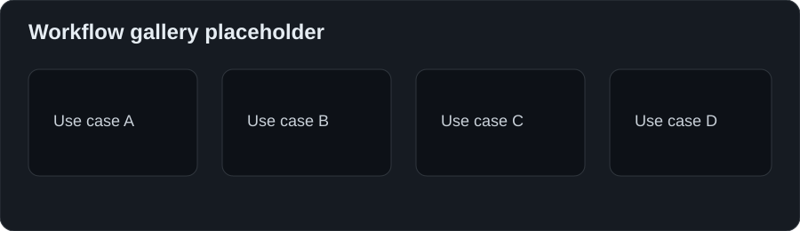
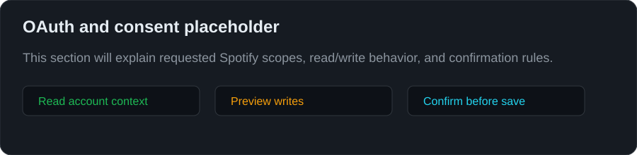

<h1 align="center">Save to Spotify</h1>

<p align="center">
  <strong>The official Spotify skill for saving agent-made audio to Spotify.</strong>
</p>

<p align="center">
  Ask your agent for audio. Get a Spotify episode with metadata, cover art, chapters, timeline images, links, and Spotify cards.
</p>

<p align="center">
  <a href="https://officialskills.sh/spotify/save-to-spotify"><strong>OfficialSkills</strong></a> ·
  <a href="https://clawhub.ai/spotify/save-to-spotify"><strong>ClawHub</strong></a> ·
  <a href="#install"><strong>Install</strong></a> ·
  <a href="#quick-start"><strong>Quick start</strong></a>
</p>

<p align="center">
  
  
</p>

## Install

Prompt your agent to install:

```text
> Install Save to Spotify by running https://saveto.spotify.com/install.sh
```

Or run it yourself:

```bash
curl -fsSL https://saveto.spotify.com/install.sh | bash
save-to-spotify auth login
save-to-spotify doctor
```

## Quick start

Give your agent a source and a destination:

```text
Turn [placeholder source] into a [placeholder length] Spotify episode.
Use [placeholder tone].
Save it to [placeholder show].
Preview before uploading.
```

Good sources can be files, links, notes, transcripts, or existing audio.

<p align="center">
  
</p>

## What you get

- Spotify episode upload
- show and episode metadata
- cover image
- chapters
- timeline images
- source links
- Spotify entity cards
- readiness checks

<p align="center">
  
</p>

## Useful commands

```bash
save-to-spotify auth status
save-to-spotify doctor
save-to-spotify upload ./episode.mp3 --title "[placeholder title]"
save-to-spotify --json timeline validate --from-file timeline.json
```

## Safety

Save to Spotify should be easy to trust:

- preview before upload or write actions
- show the active Spotify account
- explain requested OAuth scopes
- separate read-only checks from changes
- validate the result after upload

<p align="center">
  
</p>

## For agent builders

Keep the skill simple and helpful:

- start from user intent, not CLI flags
- ask only what changes the result
- use sensible defaults
- preview before mutation
- return links and validation status
- recover clearly from auth, rate limits, or partial failures

## Other install paths

```bash
openclaw skills install @spotify/save-to-spotify
npx skills add spotify/save-to-spotify
```

## Placeholder assets

Replace these before launch:

- `assets/workflow-gallery.svg`
- `assets/episode-card-placeholder.svg`
- `assets/timeline-preview.svg`
- `assets/oauth-scope-preview.svg`
